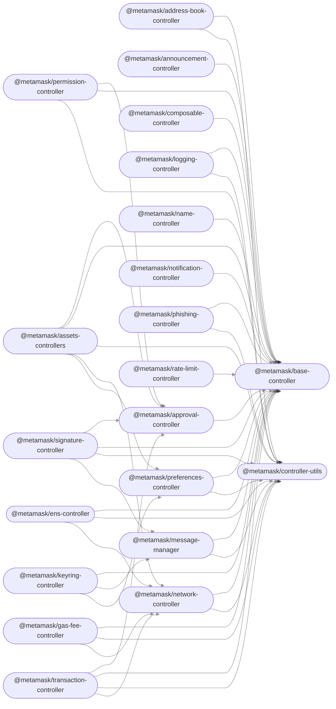

# MetaMask

[](https://github.com/MetaMask/metamask-mobile/actions/workflows/ci.yml) [](https://github.com/MetaMask/metamask-mobile/actions/workflows/cla.yml)

<div align="center">


<!-- Nothing weird to see here -->
<p align="center">
  <a href="https://readme.andyruwruw.com/api/now-playing?open">
    <!-- Music bars move to the beat and are colored based on the track's happiness, danceability and energy! -->
    
    <!-- This is how you'd make the call dynamically  -->
  </a>
</p>

<div align="center">


Today we're going to build a simple React / Web3 Dapp that replicates a small portion of the Uniswap v2 interface - specifically, we are building the "account login" button that allows users to connect to a Dapp using their MetaMask extension.

By the end of the tutorial you will have a working React app that will be able to connect to your MetaMask account, and read your address & ETH balance. If you connect with multiple accounts the interface will change to reflect the active account. 

A lot of tutorials skip this basic login strategy, or use outdated libraries (which you don't find out until you're halfway through!). To avoid confusion, as of July, 2021 this tutorial & the accompanying repo uses the following tech:

MetaMask is a mobile wallet that provides easy access to websites that use the [Ethereum](https://ethereum.org/) blockchain.

For up to the minute news, follow our [Twitter](https://twitter.com/metamask) or [Medium](https://medium.com/metamask) pages.

To learn how to develop MetaMask-compatible applications, visit our [Developer Docs](https://docs.metamask.io).




## Getting Started

There are 2 packages in this repo: a [`backend`](./packages/backend) which is a REST API written in Express, and a [`frontend`](./packages/frontend) which is a React single-page application. It's really a demo, so I tried to use as few libraries as possible, and the most popular ones when possible.

The simplest way to get started is to launch the demo using Docker Compose. Alternatively you could launch docker the containers manually, or run the node services using yarn.

#### 1. Launch the demo using Docker Compose:

```bash
docker-compose up -d
```

This will setup the bakcend listening on `localhost:8000` and the frontend on `localhost:3000`.

#### 2. Launching the demo using Docker:

Build and launch the backend:

```bash
cd backend
docker build -t login-backend .
docker run -d -p 8000:8000 login-backend
```


### Changing dependencies

Whenever you change dependencies (adding, removing, or updating, either in `package.json` or `yarn.lock`), there are various files that must be kept up-to-date.

-   `yarn.lock`:
    -   Run `yarn setup` again after your changes to ensure `yarn.lock` has been properly updated.
-   The `allow-scripts` configuration in `package.json`
    -   Run `yarn allow-scripts auto` to update the `allow-scripts` configuration automatically. This config determines whether the package's install/postinstall scripts are allowed to run. Review each new package to determine whether the install script needs to run or not, testing if necessary.
    -   Unfortunately, `yarn allow-scripts auto` will behave inconsistently on different platforms. macOS and Windows users may see extraneous changes relating to optional dependencies.

### Backers

<a href="https://opencollective.com/democracyearth/backer/0/website"></a>
<a href="https://opencollective.com/democracyearth/backer/1/website"></a>
<a href="https://opencollective.com/democracyearth/backer/2/website"></a>
<a href="https://opencollective.com/democracyearth/backer/3/website"></a>
<a href="https://opencollective.com/democracyearth/backer/4/website"></a>
<a href="https://opencollective.com/democracyearth/backer/5/website"></a>
<a href="https://opencollective.com/democracyearth/backer/6/website"></a>
<a href="https://opencollective.com/democracyearth/backer/7/website"></a>
<a href="https://opencollective.com/democracyearth/backer/8/website"></a>
<a href="https://opencollective.com/democracyearth/backer/9/website"></a>
<a href="https://opencollective.com/democracyearth/backer/10/website"></a>
<a href="https://opencollective.com/democracyearth/backer/11/website"></a>

## Contributing

Contributions are welcome, but please follow these contributor guidelines outlined in [CONTRIBUTING.md](CONTRIBUTING.md).

## License

metamask is licensed under a [BSD 2-Clause License](LICENSE.md) and is copyright [Intoli, LLC](https://intoli.com).
